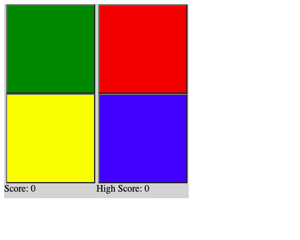
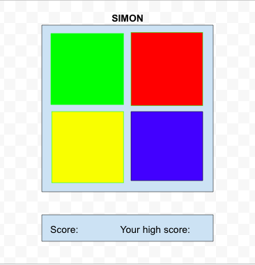

# Project 1

### Technologies used

-HTML
-CSS
-Javascript

### Installation instructions

Clone this repo. Open the HTML file in a browser manually or with a live server.

### User Stories

-As a player, I want a game-board with the four colors green, red, yellow, and blue, so that the colors match the real-life game.
-As a player, I want the game to play a sequence of flashing colors, starting with one, and increasing by one color each time I successfully repeat the sequence, so that I can test my memory skills.
-As a player, I want the game to register my choice when I click on a colored button, so I can repeat the sequence.
-As a player, I want a score board that tracks my score so I can see how well I am doing.

-As a player, I want a highest score displayed on the score board, so I can keep track of my best score and try to beat it.
-As a player, I want the buttons to make sounds when the flash or when they are clicked, to simulate a real Simon game experience.

### Wireframes

### Problems/Hurdles

One major hurdle I had to overcome was getting the buttons to flash correctly. At first, when I used a for loop, they would all flash at the same time. I worked with my course's instructional assistant during office hours to solve this issue. We used a combination of setInterval and setTimeout to get the buttons to flash in sequence.

Another hurdle I had was that when the game was over, it would keep playing the sequence. I fixed this by rearranging an if statement in the code.
